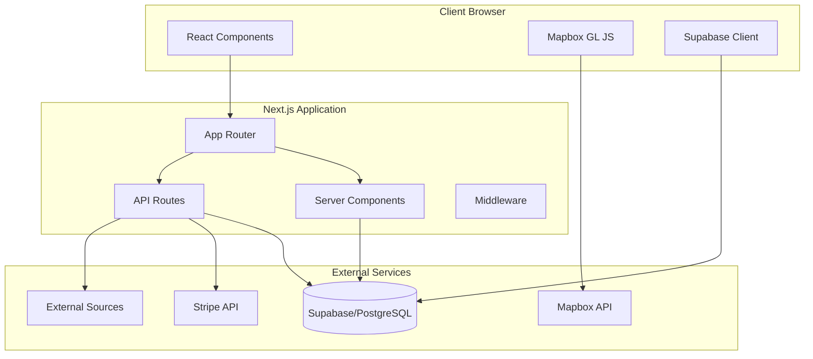

# Architecture Overview

## System Architecture

The Peripheral application follows a modern full-stack architecture using Next.js 14 with server and client components.



## Application Layers

### 1. Presentation Layer (Frontend)

**Technologies**: React 18, TypeScript, Tailwind CSS, Mapbox GL JS

**Key Components**:
- **Globe Visualization** (`app/page.tsx`): Interactive 3D globe with real-time data
- **Stories Feed** (`app/components/StoriesFeed.tsx`): News aggregation display
- **Feature Pages**: Regional tracking (Venezuela, Iran), ICE videos, Chat

**State Management**:
- React hooks (useState, useEffect, useRef)
- Local component state for UI interactions
- Real-time updates via Supabase subscriptions

### 2. Application Layer (Next.js)

**Server Components**:
- Initial data fetching
- SEO optimization
- Static generation where possible

**Client Components** (`'use client'`):
- Interactive features
- Browser API usage
- Real-time updates

**API Routes** (`app/api/`):
- Data transformation
- External API integration
- Security enforcement
- Rate limiting

### 3. Data Layer (Supabase)

**Database Schema**:
```sql
-- Core tables
story                    -- Main story/event records
news_item               -- Individual news items
osint_source           -- News sources

-- Entity tables
entity_location        -- Geographic entities
entity_person         -- People mentioned
entity_organisation   -- Organizations

-- Relationship tables
story_entity_location     -- Story-location associations
story_entity_person      -- Story-person associations
story_entity_organisation -- Story-org associations

-- Location data
event_location         -- Actual event coordinates
```

**Database Functions (RPC)**:
- `get_location_aggregates_v2()`: Aggregate locations with post counts
- `get_location_posts()`: Fetch posts by location

## Data Flow

### Globe Visualization Flow

```
1. Page Load
   ├── Server Component fetches initial data
   ├── Hydrate client with data
   └── Initialize Mapbox GL

2. Data Fetching
   ├── Call /api/sentinel/globe
   ├── Execute Supabase RPC functions
   ├── Aggregate location data
   └── Return formatted response

3. Rendering
   ├── Plot locations on globe
   ├── Create marker layers
   ├── Add animation layers
   └── Setup interaction handlers

4. User Interaction
   ├── Click detection
   ├── Zoom to location
   ├── Fetch location details
   └── Display story cards
```

### Story Processing Pipeline

```
1. Story Ingestion (External)
   ├── OSINT sources provide data
   ├── Stories created in database
   └── Entities extracted

2. Entity Enrichment
   ├── Locations geocoded
   ├── People identified
   ├── Organizations tagged
   └── Relationships mapped

3. API Delivery
   ├── /api/stories/latest
   ├── /api/stories/trending
   └── /api/stories/country/[country]

4. Frontend Display
   ├── StoriesFeed component
   ├── Entity highlighting
   └── Media rendering
```

## Security Architecture

### Authentication & Authorization

- **Public Access**: Anonymous Supabase key for read operations
- **Server Operations**: Service role key for privileged operations
- **Row Level Security**: Database-level access control

### API Security

1. **Image Proxy** (`/api/proxy-image`):
   - URL validation (HTTPS only)
   - Private IP blocking
   - Content-type checking
   - Size limits (10MB)
   - Timeout protection (15s)

2. **Rate Limiting**:
   - Per-IP tracking
   - Sliding window algorithm
   - Headers for client awareness

3. **Input Validation**:
   - Query parameter sanitization
   - Type checking with TypeScript
   - Range validation

## Performance Architecture

### Client-Side Optimizations

1. **Animation Performance**:
   - RequestAnimationFrame for 60fps
   - GPU acceleration via Mapbox GL
   - Debounced interactions
   - Cleanup on unmount

2. **Code Splitting**:
   - Next.js automatic splitting
   - Dynamic imports for heavy components
   - Route-based chunking

3. **Asset Optimization**:
   - Image proxy with caching
   - CDN distribution via Vercel
   - Compressed responses

### Server-Side Optimizations

1. **Caching Strategy**:
   ```
   Static Assets    → CDN (immutable)
   API Responses    → Browser (1-60 min)
   Images          → CDN + Browser (24h)
   ```

2. **Database Optimization**:
   - Indexed queries
   - Materialized aggregates
   - Connection pooling
   - RPC functions for complex queries

## Deployment Architecture

### Infrastructure

```
GitHub Repository
    ↓
GitHub Actions CI/CD
    ↓
Vercel Platform
    ├── Edge Network (CDN)
    ├── Serverless Functions (API)
    └── Static Hosting (Assets)

External Services:
    ├── Supabase (Database + Auth)
    ├── Mapbox (Maps)
    └── Stripe (Payments)
```

### Environment Configuration

**Development**:
- Local Next.js dev server
- Hot module replacement
- Source maps enabled

**Production**:
- Optimized builds
- Minification
- Environment variables via Vercel

## Scalability Considerations

### Horizontal Scaling

- **Vercel**: Auto-scaling serverless functions
- **Supabase**: Managed PostgreSQL scaling
- **CDN**: Global edge distribution

### Vertical Scaling

- **Database**: Upgrade Supabase tier for more resources
- **API Limits**: Increase rate limits as needed
- **Mapbox**: Higher tier for more map loads

### Performance Bottlenecks

1. **Globe Data Loading**:
   - Solution: Pagination, data aggregation
   - Current: 35 locations default, 50 max

2. **Animation Rendering**:
   - Solution: LOD (Level of Detail) system
   - Current: 3 animation layers maximum

3. **Database Queries**:
   - Solution: Indexes, caching, CDN
   - Current: RPC functions for optimization

## Monitoring & Observability

### Application Monitoring

- **Vercel Analytics**: Performance metrics
- **Error Boundaries**: React error catching
- **Console Logging**: Development debugging

### Recommended Additions

1. **Error Tracking**: Sentry integration
2. **Performance Monitoring**: Web Vitals tracking
3. **User Analytics**: Privacy-respecting analytics
4. **API Monitoring**: Response time tracking

## Technology Decisions

### Why Next.js 14?

- **Server Components**: Better SEO and initial load
- **App Router**: Modern routing with layouts
- **API Routes**: Backend without separate server
- **Vercel Integration**: Seamless deployment

### Why Mapbox GL?

- **Globe Projection**: Native 3D globe support
- **Performance**: GPU-accelerated rendering
- **Customization**: Full style control
- **Features**: Animations, interactions, layers

### Why Supabase?

- **PostgreSQL**: Robust relational database
- **Real-time**: WebSocket subscriptions
- **Auth**: Built-in authentication
- **RPC**: Custom database functions

### Why TypeScript?

- **Type Safety**: Catch errors at compile time
- **IDE Support**: Better autocomplete
- **Documentation**: Self-documenting code
- **Refactoring**: Safer code changes

## Future Architecture Considerations

### Potential Enhancements

1. **Microservices**: Extract heavy processing
2. **Queue System**: Background job processing
3. **Search**: Elasticsearch integration
4. **ML Pipeline**: Entity extraction improvement
5. **WebSockets**: Custom real-time updates

### Technical Debt

Current issues to address:
- 0% test coverage
- Missing error handling in places
- Type assertions need cleanup
- Performance optimizations needed

## Conclusion

The architecture provides a solid foundation for a real-time geopolitical intelligence platform with room for growth and optimization. The use of modern technologies ensures maintainability and scalability while keeping operational complexity manageable.