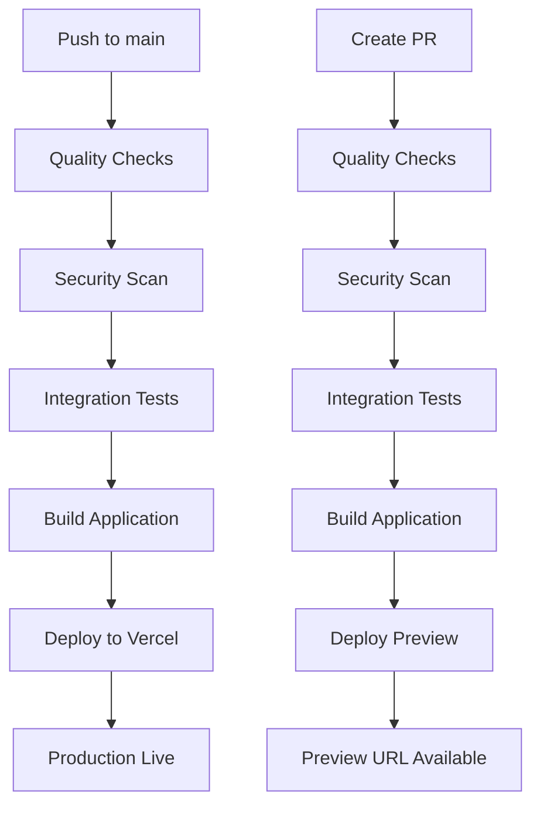

# 🚀 Deployment Guide

## Overview

Event Horizon uses **Vercel + GitHub Actions** for automated deployment with the following benefits:

- ✅ **Zero-cost hosting** (Vercel Hobby tier)
- ✅ **Preview URLs** for every PR
- ✅ **Single source of truth** (deploy only after all quality checks pass)
- ✅ **No double builds** (build once in CI, deploy prebuilt artifact)

## 🔧 Setup Instructions

### 1. Vercel Project Setup

1. **Connect your GitHub repo to Vercel:**
   - Go to [vercel.com](https://vercel.com)
   - Import your GitHub repository
   - Choose **"Next.js"** framework preset
   - Set root directory to `.` (current setup)

2. **Configure Environment Variables in Vercel Dashboard:**
   ```
   NEXT_PUBLIC_MAPBOX_TOKEN=your_mapbox_token
   SUPABASE_URL=your_supabase_url
   SUPABASE_ANON_KEY=your_supabase_anon_key
   ```

### 2. GitHub Secrets Setup

Add these secrets in your GitHub repository:
**Settings → Secrets and variables → Actions**

| Secret | How to obtain |
|--------|---------------|
| `VERCEL_TOKEN` | Vercel Dashboard → Account → Settings → Tokens |
| `VERCEL_ORG_ID` | Vercel Dashboard → Project → Settings → General (ID string) |
| `VERCEL_PROJECT_ID` | Same page as ORG_ID |

### 3. Deployment Workflow

The deployment workflow (`vercel-deployment.yml`) automatically:

- **On PR:** Creates preview deployments
- **On main push:** Deploys to production
- **Builds once:** Uses prebuilt artifacts to avoid double builds

## 🔄 Deployment Flow



## 📋 Quality Gates

Before deployment, the following checks must pass:

1. **Frontend Quality** (`frontend-quality.yml`)
   - TypeScript type checking
   - ESLint validation
   - Next.js configuration validation

2. **Backend Tests** (`backend-tests.yml`)
   - API routes structure validation
   - Supabase integration checks

3. **Integration Tests** (`integration-tests.yml`)
   - API endpoint accessibility
   - Mapbox token validation
   - Supabase data access

4. **Security Scan** (`security-scan.yml`)
   - npm audit for vulnerabilities
   - Snyk security scanning
   - Hardcoded secret detection

5. **Next.js Tests** (`nextjs-tests.yml`)
   - Build process validation
   - Bundle size analysis
   - Performance checks

## 🎯 Benefits

### **For Developers:**
- **Preview URLs:** Every PR gets a live preview
- **Quality Gates:** Deploy only after all checks pass
- **Fast Feedback:** Immediate deployment status

### **For Analysts:**
- **Live Previews:** Review UI changes before merge
- **Stable Production:** Only tested code reaches production
- **Zero Downtime:** Instant deployments

### **For Operations:**
- **Zero Cost:** Vercel Hobby tier covers everything
- **Automatic Scaling:** Vercel handles traffic spikes
- **Global CDN:** Fast loading worldwide

## 🔍 Troubleshooting

### **Deployment Fails:**
1. Check GitHub Actions logs for specific errors
2. Verify environment variables in Vercel dashboard
3. Ensure all quality checks pass

### **Preview Not Working:**
1. Check PR status for failed checks
2. Verify Vercel secrets are set correctly
3. Check Vercel dashboard for deployment status

### **Environment Variables:**
1. Ensure `NEXT_PUBLIC_` prefix for client-side variables
2. Verify Supabase credentials are correct
3. Check Mapbox token validity

## 📊 Monitoring

### **GitHub Actions:**
- View workflow runs in Actions tab
- Check individual job logs for errors
- Monitor deployment status

### **Vercel Dashboard:**
- View deployment history
- Monitor performance metrics
- Check function logs

## 🚀 Advanced Configuration

### **Custom Domain:**
1. Add domain in Vercel dashboard
2. Configure DNS records
3. Enable SSL certificate

### **Environment-Specific Variables:**
- Use Vercel's environment variable management
- Configure different values for preview/production

### **Performance Optimization:**
- Enable Vercel Analytics
- Configure caching headers
- Optimize bundle size

## 📞 Support

For deployment issues:
1. Check GitHub Actions logs
2. Review Vercel deployment logs
3. Verify environment variables
4. Test locally with `npm run build` 