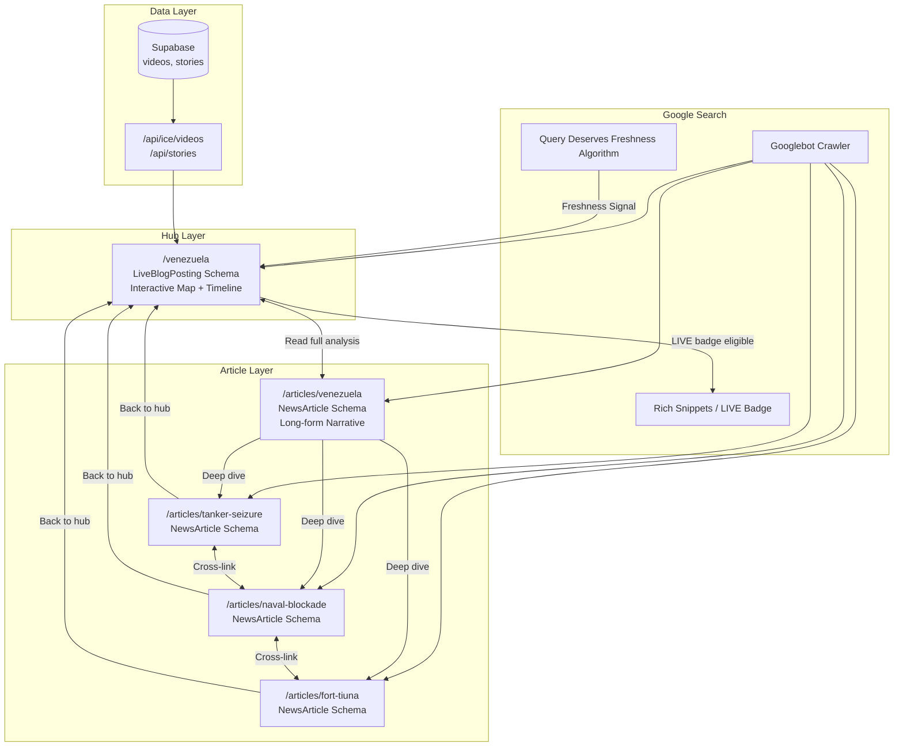
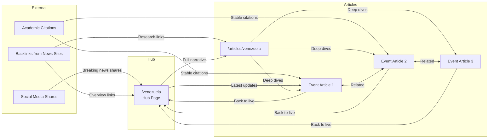
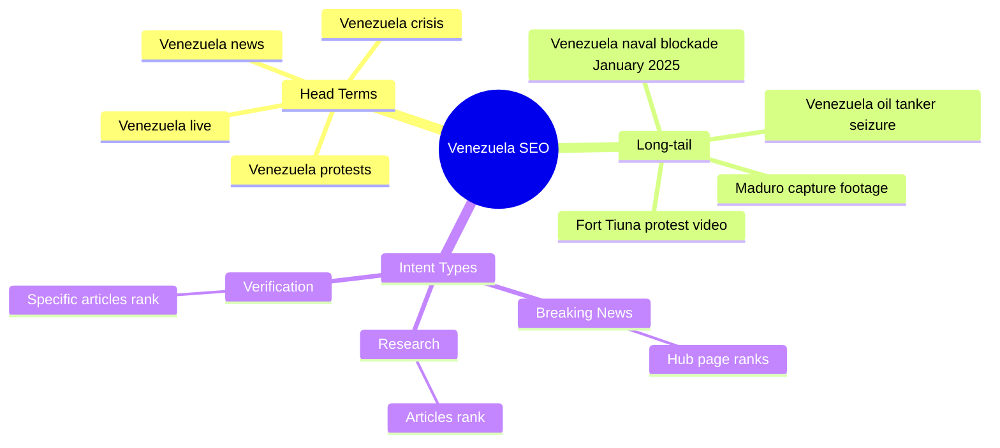
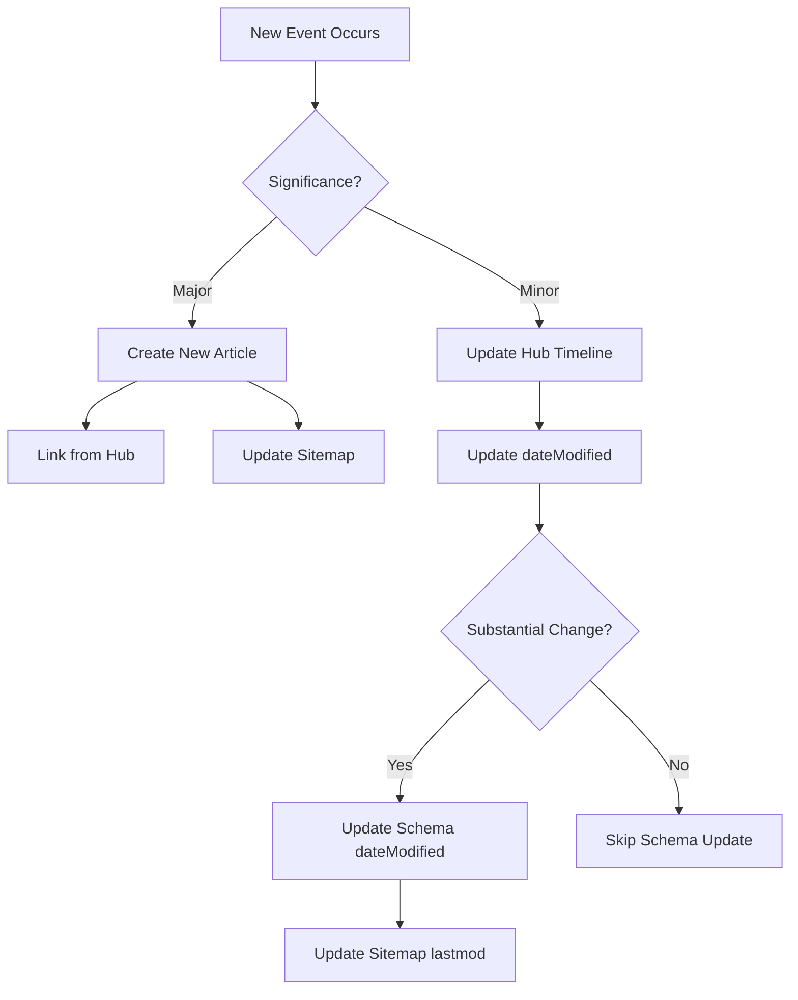
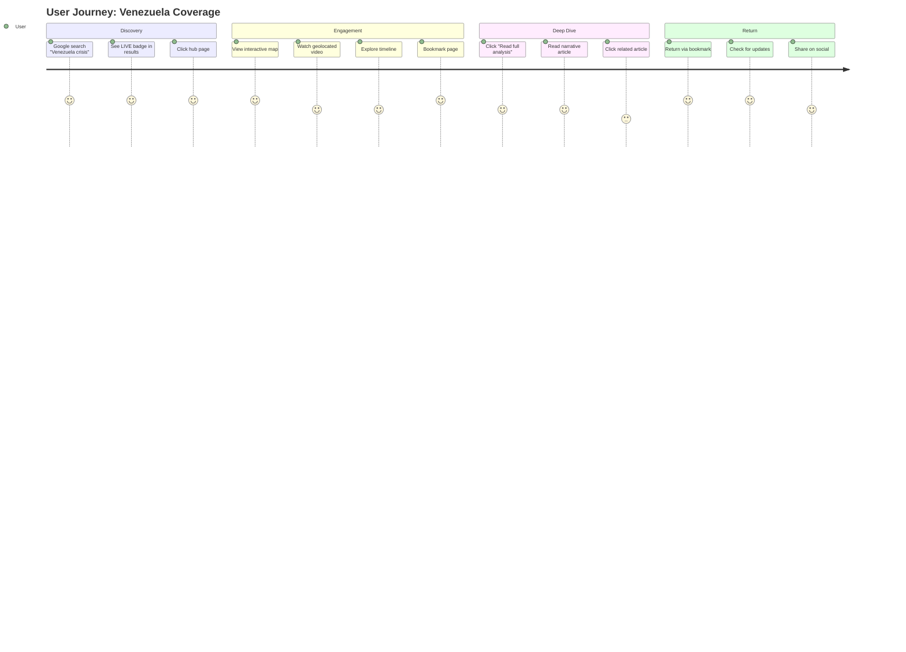

# SEO Strategy: Hub-and-Spoke Model for Live Coverage

This document outlines the SEO architecture for Peripheral's live coverage pages, based on research into Google's freshness algorithms, structured data requirements, and user engagement patterns.

## Executive Summary

Peripheral uses a **Hub-and-Spoke model** combining:
- **Live Hub Pages** (`/venezuela`) - Interactive maps, timelines, video galleries with `LiveBlogPosting` schema
- **Narrative Articles** (`/articles/venezuela`) - Long-form SEO-optimized content with `NewsArticle` schema
- **Deep-Dive Articles** (`/articles/[slug]`) - Individual event coverage targeting long-tail keywords

This approach scores **8.7/10** across SEO factors vs 5.0 for single-page and 6.9 for blog-only approaches.

---

## Architecture Overview



---

## URL Structure

| URL | Schema Type | Purpose | Update Frequency |
|-----|-------------|---------|------------------|
| `/venezuela` | LiveBlogPosting | Live hub with map/timeline | Daily during active coverage |
| `/articles/venezuela` | NewsArticle | Canonical narrative article | Weekly |
| `/articles/[slug]` | NewsArticle | Individual event deep dives | Once, then stable |

---

## Structured Data Implementation

### LiveBlogPosting (Hub Page)

The `/venezuela` hub uses `LiveBlogPosting` schema to signal real-time updates:

```json
{
  "@context": "https://schema.org",
  "@type": "LiveBlogPosting",
  "headline": "Venezuela Crisis: Live Updates & Verified Footage",
  "datePublished": "2025-01-15T00:00:00Z",
  "dateModified": "2025-01-26T14:30:00Z",
  "coverageStartTime": "2025-01-15T00:00:00Z",
  "about": {
    "@type": "Event",
    "name": "Venezuela Political Crisis 2025"
  },
  "liveBlogUpdate": [
    {
      "@type": "BlogPosting",
      "headline": "Fort Tiuna activity captured",
      "datePublished": "2025-01-25T14:30:00Z"
    }
  ]
}
```

**Benefits:**
- Eligible for Google's LIVE badge in search results
- Query Deserves Freshness (QDF) algorithm boost
- Higher engagement (48s avg vs 28s for traditional articles)

### NewsArticle (Individual Articles)

```json
{
  "@context": "https://schema.org",
  "@type": "NewsArticle",
  "headline": "Fort Tiuna Protest: Complete Timeline",
  "datePublished": "2025-01-20T15:00:00Z",
  "isPartOf": {
    "@type": "LiveBlogPosting",
    "@id": "https://peripheral.local/venezuela"
  }
}
```

---

## Link Flow Architecture



### Link Strategy

1. **Hub → Articles**: "Read our detailed analysis" links in timeline entries
2. **Articles → Hub**: "Return to live coverage" prominent CTA
3. **Articles ↔ Articles**: "Related coverage" sections
4. **External → Hub**: Social shares during breaking news
5. **External → Articles**: Research citations to stable URLs

---

## Keyword Strategy



### Keyword Mapping

| Keyword Type | Target Page | Example |
|--------------|-------------|---------|
| Head terms | `/venezuela` hub | "Venezuela crisis" |
| Narrative | `/articles/venezuela` | "Venezuela crisis explained" |
| Long-tail events | `/articles/[slug]` | "Fort Tiuna protest January 2025" |
| Verification | `/articles/[slug]` | "Venezuela video verification OSINT" |

---

## Google Algorithm Alignment

### Query Deserves Freshness (QDF)

Google's QDF algorithm (affects ~35% of queries) categorizes searches:

| Category | Hub Page | Articles |
|----------|----------|----------|
| Breaking news | Primary target | Secondary |
| Recent events | Strong | Strong |
| Ongoing coverage | Primary target | Supporting |
| Evergreen | Secondary | Primary |

### Update Protocol



**Update Rules:**
- Update `dateModified` only for substantial changes (new videos, major events)
- Do NOT update dates for typo fixes (Google penalizes fake freshness)
- Ensure schema date = visible date = sitemap lastmod

---

## User Engagement Flow



### Engagement Metrics Targets

| Metric | Hub Page Target | Article Target |
|--------|-----------------|----------------|
| Avg. Engagement Time | 45+ seconds | 3+ minutes |
| Return Visitor Rate | 40%+ | 15%+ |
| Scroll Depth | 60%+ | 80%+ |
| Internal Link Clicks | 25%+ | 30%+ |

---

## Technical SEO Considerations

### JavaScript Rendering

The hub page uses Mapbox (client-side JS). Mitigation:

1. **noscript fallback**: Basic HTML for crawlers
2. **Static video list**: Render HTML list alongside map
3. **Server component wrapper**: Metadata and schema on server

```tsx
// page.tsx (Server Component)
export const metadata = { ... }

export default function VenezuelaPage() {
  return (
    <>
      <script type="application/ld+json">...</script>
      <noscript>
        <article>
          <h1>Venezuela Crisis</h1>
          <p>Enable JavaScript for interactive map.</p>
          <a href="/articles/venezuela">Read text version</a>
        </article>
      </noscript>
      <VenezuelaClient />
    </>
  )
}
```

### Sitemap Priority

```typescript
// app/sitemap.ts
{
  url: `${baseUrl}/venezuela`,
  priority: 0.95,  // Highest for live hub
  changeFrequency: 'hourly',
},
{
  url: `${baseUrl}/articles/venezuela`,
  priority: 0.9,
  changeFrequency: 'weekly',
},
// Individual articles: 0.7, monthly
```

---

## Implementation Checklist

### Hub Page (`/venezuela`)
- [x] Server component wrapper with metadata
- [x] LiveBlogPosting JSON-LD schema
- [x] coverageStartTime and liveBlogUpdate entries
- [x] noscript fallback for crawlers
- [x] Link to narrative article
- [ ] "Latest Developments" section with article links
- [ ] VideoObject schema for each geolocated video

### Narrative Article (`/articles/venezuela`)
- [x] NewsArticle JSON-LD schema
- [x] OpenGraph and Twitter cards
- [x] Semantic HTML structure
- [x] Related articles section
- [ ] Bidirectional hub link ("Return to live coverage")

### Individual Articles
- [x] Dynamic [slug] template
- [x] NewsArticle schema
- [ ] isPartOf linking to hub
- [ ] Cross-linking between related articles

### Infrastructure
- [x] robots.ts (allow /, disallow /api/)
- [x] sitemap.ts with priority levels
- [x] manifest.ts for PWA
- [ ] Dynamic sitemap generation for articles

---

## Monitoring

### Google Search Console
- Track impressions/clicks for hub vs articles
- Monitor LIVE badge appearance
- Check for cannibalization (same query, multiple pages)

### Rich Results Test
- Validate LiveBlogPosting schema weekly
- Verify liveBlogUpdate entries are current

### Analytics (GA4)
- Compare engagement: hub vs articles
- Track return visitor patterns
- Measure internal link click-through

---

## References

- [Google LiveBlogPosting Documentation](https://developers.google.com/search/docs/appearance/structured-data/article#live-blog)
- [Query Deserves Freshness Algorithm](https://searchengineland.com/guide/query-deserves-freshness-qdf)
- [Hub and Spoke Content Model](https://victorious.com/blog/hub-and-spoke-content-model/)
- [JavaScript SEO Best Practices](https://developers.google.com/search/docs/crawling-indexing/javascript)

---

## File Locations

| File | Purpose |
|------|---------|
| `app/venezuela/page.tsx` | Hub page with LiveBlogPosting schema |
| `app/venezuela/VenezuelaClient.tsx` | Interactive map/timeline client component |
| `app/articles/venezuela/page.tsx` | Canonical narrative article |
| `app/articles/[slug]/page.tsx` | Dynamic article template |
| `app/sitemap.ts` | Sitemap with priority levels |
| `app/robots.ts` | Crawler directives |
| `docs/seo/SEO_STRATEGY.md` | This document |
