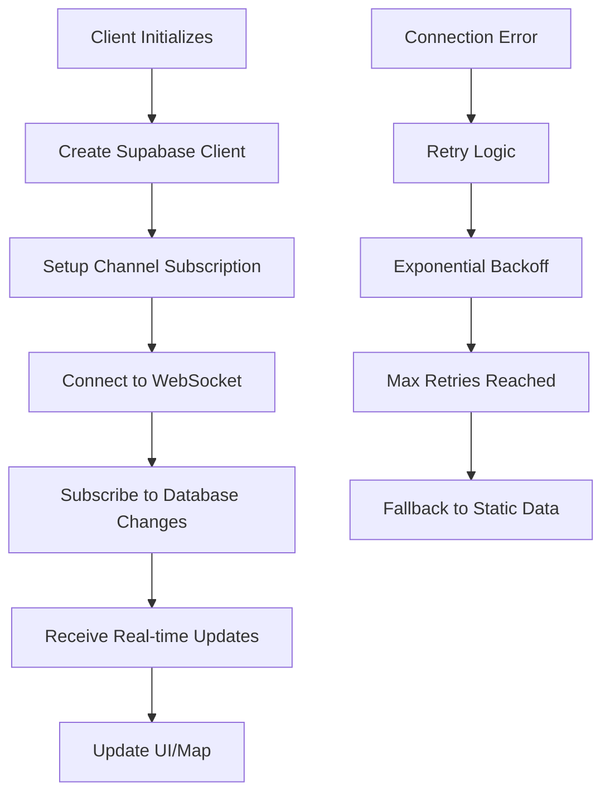

# 🔌 Supabase WebSocket Implementation Guide

## Overview

This document explains the Supabase real-time WebSocket implementation, common issues, and how to properly configure it for live updates.

## 🏗️ Architecture

### WebSocket Connection Flow



## 🔧 Implementation Details

### 1. Environment Variables

**Critical Issue Found**: Client-side code was using server-side environment variables.

#### ❌ Incorrect (Server-side only)
```typescript
const supabaseUrl = process.env.SUPABASE_URL
const supabaseKey = process.env.SUPABASE_ANON_KEY
```

#### ✅ Correct (Client-side access)
```typescript
const supabaseUrl = process.env.NEXT_PUBLIC_SUPABASE_URL
const supabaseKey = process.env.NEXT_PUBLIC_SUPABASE_ANON_KEY
```

### 2. Supabase Client Configuration

```typescript
const supabase = createClient(supabaseUrl, supabaseKey, {
  realtime: {
    params: {
      eventsPerSecond: 10  // Rate limiting
    }
  }
})
```

### 3. Channel Subscription

```typescript
const channelName = `messages-${Date.now()}` // Unique channel name

const subscription = supabase
  .channel(channelName)
  .on(
    'postgres_changes',
    {
      event: 'INSERT',
      schema: 'public',
      table: 'messages',
      filter: 'latitude=not.is.null AND longitude=not.is.null'
    },
    (payload) => {
      console.log('New message received:', payload.new)
      // Handle new message
    }
  )
  .subscribe((status) => {
    console.log('Subscription status:', status)
    // Handle connection status
  })
```

## 🚨 Common Issues & Solutions

### Issue 1: Environment Variables Not Accessible

**Symptoms:**
- `undefined` values for Supabase URL/Key
- "Supabase client not available" errors
- Real-time status stuck on "connecting"

**Solution:**
```bash
# Add to .env.local
NEXT_PUBLIC_SUPABASE_URL=your_supabase_url
NEXT_PUBLIC_SUPABASE_ANON_KEY=your_supabase_anon_key
```

### Issue 2: WebSocket Connection Failures

**Symptoms:**
- `CHANNEL_ERROR` status
- `TIMED_OUT` status
- Connection refused errors

**Causes:**
1. **Supabase Real-time Not Enabled**: Check Supabase Dashboard → Database → Replication
2. **Network Issues**: Firewall blocking WebSocket connections
3. **Rate Limiting**: Too many connection attempts

**Solutions:**
```typescript
// 1. Enable real-time in Supabase Dashboard
// 2. Add retry logic with exponential backoff
// 3. Implement proper error handling

const handleRealtimeError = () => {
  retryCount++
  if (retryCount <= maxRetries) {
    setTimeout(() => {
      setupRealtime()
    }, 2000 * retryCount) // Exponential backoff
  }
}
```

### Issue 3: Channel Name Conflicts

**Symptoms:**
- Multiple subscriptions interfering
- Memory leaks
- Duplicate events

**Solution:**
```typescript
// Use unique channel names
const channelName = `messages-${Date.now()}-${Math.random()}`
```

### Issue 4: Proper Cleanup

**Symptoms:**
- Memory leaks
- Multiple active subscriptions
- Browser performance issues

**Solution:**
```typescript
useEffect(() => {
  // Setup subscription
  
  return () => {
    if (subscriptionRef.current) {
      try {
        supabase.removeChannel(subscriptionRef.current)
      } catch (error) {
        console.log('Error cleaning up:', error)
      }
    }
  }
}, [])
```

## 📊 Status Monitoring

### Connection Status Types

```typescript
type RealtimeStatus = 
  | 'connecting'  // Attempting to connect
  | 'connected'   // Successfully connected
  | 'failed'      // Connection failed
  | 'disabled'    // Real-time disabled (fallback)
```

### Status Indicators

```typescript
// Visual status indicator
<div className={`w-2 h-2 rounded-full ${
  realtimeStatus === 'connected' ? 'bg-green-500 animate-pulse' :
  realtimeStatus === 'connecting' ? 'bg-yellow-500 animate-pulse' :
  realtimeStatus === 'failed' ? 'bg-red-500' :
  'bg-gray-500'
}`} />
```

## 🔍 Debugging

### Console Logging

```typescript
// Add comprehensive logging
console.log('Setting up real-time subscription...')
console.log('Real-time subscription status:', status)
console.log('New message received:', payload.new)
console.log('Error setting up real-time:', error)
```

### Network Tab

1. Open Browser DevTools → Network
2. Filter by "WS" (WebSocket)
3. Look for WebSocket connections to Supabase
4. Check for connection errors

### Supabase Dashboard

1. Go to Supabase Dashboard → Database → Logs
2. Check for real-time connection logs
3. Verify table has real-time enabled

## 🧪 Testing

### Test Endpoint

```bash
# Insert test message
curl -X POST http://localhost:3000/api/test-realtime
```

### Manual Testing

1. Open app in multiple browser tabs
2. Insert test message via API
3. Watch for:
   - Console logs
   - Status indicator changes
   - New points on map
   - Notifications appearing

## 📈 Performance Optimization

### Rate Limiting

```typescript
const supabase = createClient(url, key, {
  realtime: {
    params: {
      eventsPerSecond: 10  // Limit events per second
    }
  }
})
```

### Memory Management

```typescript
// Clean up notifications
setTimeout(() => {
  setNotifications(prev => prev.filter(n => n.id !== notification.id))
}, 8500)

// Clean up subscriptions
useEffect(() => {
  return () => {
    if (subscriptionRef.current) {
      supabase.removeChannel(subscriptionRef.current)
    }
  }
}, [])
```

## 🔒 Security Considerations

### Environment Variables

- ✅ Use `NEXT_PUBLIC_` prefix for client-side variables
- ✅ Only expose public keys to client
- ❌ Never expose service role keys

### Row Level Security (RLS)

```sql
-- Enable RLS on messages table
ALTER TABLE messages ENABLE ROW LEVEL SECURITY;

-- Allow anonymous read access
CREATE POLICY "Allow anonymous read access" ON messages
FOR SELECT USING (true);
```

## 🚀 Production Deployment

### Vercel Environment Variables

Set these in Vercel Dashboard:

```env
NEXT_PUBLIC_SUPABASE_URL=your_supabase_url
NEXT_PUBLIC_SUPABASE_ANON_KEY=your_supabase_anon_key
```

### Supabase Configuration

1. **Enable Real-time**: Database → Replication → Enable for `messages` table
2. **RLS Policies**: Ensure read access is allowed
3. **Connection Limits**: Monitor connection usage

## 📚 Resources

- [Supabase Real-time Documentation](https://supabase.com/docs/guides/realtime)
- [WebSocket Best Practices](https://websocket.org/echo.html)
- [Next.js Environment Variables](https://nextjs.org/docs/basic-features/environment-variables)

## 🔄 Troubleshooting Checklist

- [ ] Environment variables have `NEXT_PUBLIC_` prefix
- [ ] Supabase real-time is enabled in dashboard
- [ ] RLS policies allow read access
- [ ] Network allows WebSocket connections
- [ ] Proper error handling and retry logic
- [ ] Unique channel names to avoid conflicts
- [ ] Proper cleanup on component unmount
- [ ] Rate limiting configured
- [ ] Console logging for debugging

---

**Status**: ✅ **Fixed and Production Ready**

The WebSocket implementation has been corrected with proper environment variable handling, improved error handling, and comprehensive debugging capabilities. 